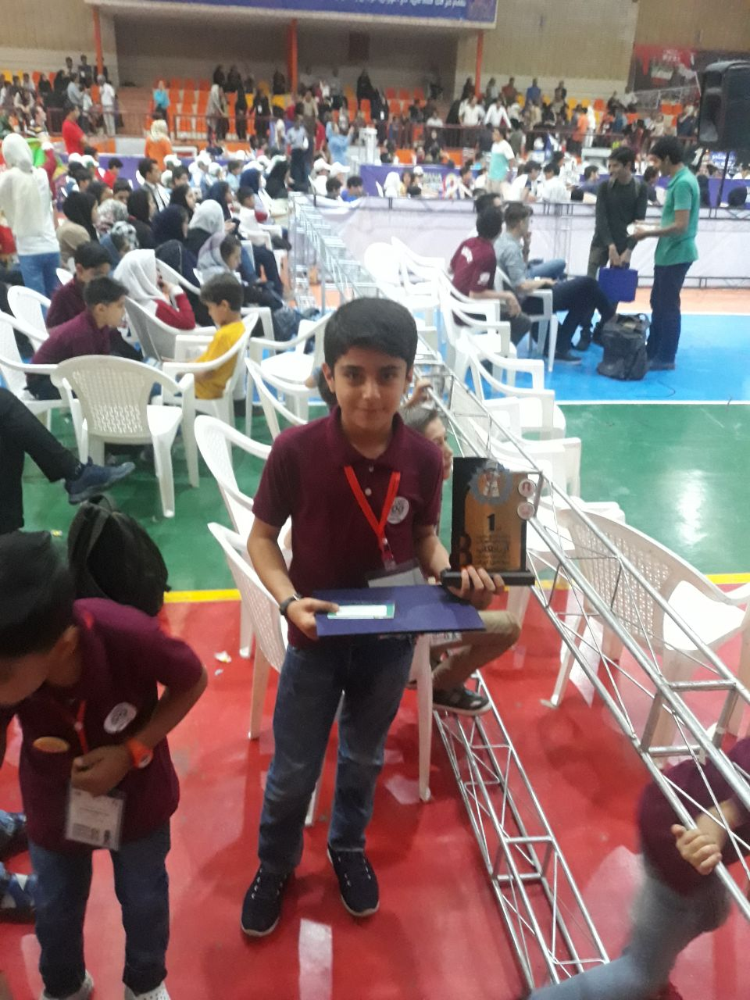

# MmmAlex172.github.io

# information
- name : Mohamad Hosein Dadkhah
- date of born : 2006 , January , 31
- birthplace : the county of Tirān in Esfahan province
# occupation
### Currently, I am studying at university and do not have a specific job. However, I am eager to find a job to increase my personal experiences.If you would like to contact me, I have provided contact methods at the end of this page.
# More About Me :
## Who Am I
### I was born into an normal family. When I was a child, I had a great interest in computers and robotics. At the age of twelve, I started working at the Aryana Robotics Institute. I studied there for a few months and in 2018, I achieved first place in the national weightlifting competition. In 2019, I secured second place in the same category. you can see me in picure below :

### However, due to the coronavirus pandemic, I did not continue with robotics.After that, I worked for a few years in a computer shop.
## My City
### as you can see I born in Tiran . Tirān is a civilized and beautiful city. In my city, there are many historical buildings as well as a number of tourist attractions. If you want more information about my city, you can go to the link below :
[Tiran](https://fa.wikipedia.org/wiki/%D8%AA%DB%8C%D8%B1%D8%A7%D9%86)
# Contact methods with me
- telegram ID : #Mmd172
- email : arexmmd.172@gmail.com
- phone number : +98 9381013351
